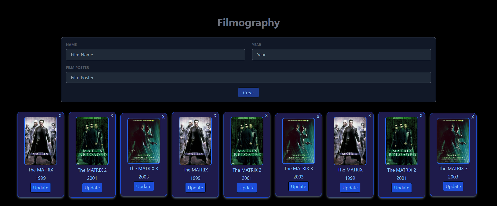

# Filmography

El objetivo de esta práctica es crear una web sobre películas con React y Tailwind parecida a la imagen siguiente:



## Requisitos

La idea es crear una plantilla a partir de componentes reutilizables. La web debe tener las siguientes características:

- El formulario es el componente _FormNewFilm_.
- El grid de películas es el componente _GridFilms_.
- La carta de cada película es el componente _Film_.
- _GridFilms_ se rellena con un **map array** de objetos con el componente _Film_.
- Todos los botones que aparecen(Crear, Eliminar(X) i Update) son componentes independientes.

## Arrancar proyecto

Para arrancar el proyecto:

```bash
npm install
npm run dev
```
