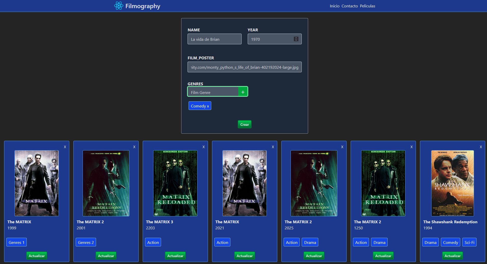

# Filmography

El objetivo de esta práctica es crear una web sobre películas con React y Tailwind parecida a la imagen siguiente:


## Requisitos

La idea es crear una plantilla a partir de componentes reutilizables. La web debe tener las siguientes características:

- El formulario es el componente _FormNewFilm_.
- El grid de películas es el componente _GridFilms_.
- La carta de cada película es el componente _Film_.
- _GridFilms_ se rellena con un **map array** de objetos con el componente _Film_.
- Todos los botones que aparecen(Crear, Eliminar(X) i Update) son componentes independientes.

## Arrancar proyecto

Para arrancar el proyecto:

```bash
npm install
npm run dev
```

## Filmography 2

Ahora vamos a mejorar la aplicación anterior añadiendo las siguientes funcionalidades:

1. Al hacer click en el botón "Crear" del formulario, enviara los datos del formulario a nuestra API en Mockapi y añadirá a la lista de películas del grid.
2. Al hacer click en el botón "Borrar" película, este será borrado de la API y actualizará el listado de películas.
3. Al hacer click en el botón "Actualizar" película en la ficha de una película, este actualizará los datos del formulario para que podamos modificarlos y al pusar el botón "Actualizar" del formulario, actualizará los datos en la API y actualizará el listado de películas.

## Filmography 3

Ahora vamos a añadir una nueva funcionalidad: Creación y asignación de géneros de películas.



1. Crear, listar y eliminar géneros en el formulario de creación de películas.
2. Al crear una película, podemos asignar o eliminar los géneros tiene al hacer click sobre ellos.
3. Al editar una película, vemos los géneros que tiene y podemos modificarlos haciendo click sobre ellos.
